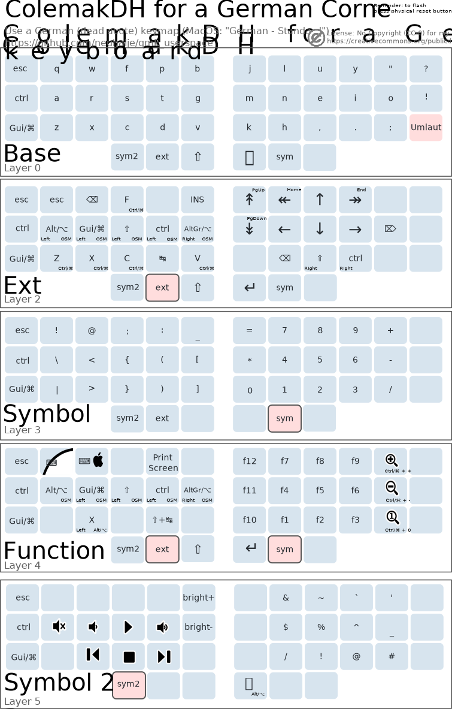

_I used [filterpaper/qmk_userspace](https://github.com/filterpaper/qmk_userspace) as a template and heavily stripped it down for my needs._

# Summary
This is my personal *userspace* for [QMK Firmware](https://github.com/qmk/qmk_firmware). It is setup as a self-contained folder that avoids placing `keymap.c` files inside keyboard sub-directories.

This keyboard layout supports a *German* *ColemakDH* layout with Linux (windows) & MacOS Support.



## Using on a Mac
Switch to the *Mac* base layout using the action in the *Function* layer.

# Building Userspace
This repository can be built as QMK's [userspace](https://docs.qmk.fm/#/feature_userspace) in a `users` folder by running `qmk compile` for the JSON files. [Actions](https://docs.github.com/en/actions) can also be leveraged to do likewise on a GitHub container with [build.yml](.github/workflows/build.yml) workflow.

# Code Features
* [OLED](oled/) indicators and animation (courtesy of [filterpaper/qmk_userspace](https://github.com/filterpaper/qmk_userspace))
  * [Bongocat](oled/oled-bongocat.c) with compressed RLE frames (courtesy of [filterpaper/qmk_userspace](https://github.com/filterpaper/qmk_userspace))
  * [Luna](oled/oled-luna.c) (and Felix) the dog
  * Soundmonster [indicator](oled/oled-icons.c) icons (courtesy of [filterpaper/qmk_userspace](https://github.com/filterpaper/qmk_userspace))

# Modular Corne (CRKBD) Build
```sh
qmk flash keymaps/corne_colemak.json -e OLED=RIGHTCAT -e TINY=y -bl avrdude-split-left
qmk flash keymaps/corne_colemak.json -e OLED=RIGHTCAT -e TINY=y -bl avrdude-split-right
```

## Compiling for OLED display
The `-e OLED=` option will build support for pet animation on primary OLED with status icons on the secondary. Animation are key stroke driven by `tap_timer`. To use WPM (at the expense of size), add `-e WPM_ENABLE=yes` to the compile commands:
### Bongocat
Build and flash each side with the corresponding options for left and right aligned Bongocat:
```
qmk compile -e OLED=LEFTCAT corne.json
qmk compile -e OLED=RIGHTCAT corne.json
```

## Minimal build
Minimal firmware with no OLED and RGB support will be compiled with `-e TINY=yes`:
```
qmk compile -e TINY=yes corne.json
```

## Logo file
Images in `glcdfont.c` can be viewed and edited with:
* [Helix Font Editor](https://helixfonteditor.netlify.app/)
* [QMK Logo Editor](https://joric.github.io/qle/)
* [image2cpp](https://javl.github.io/image2cpp/)


# Useful Links
* [Corne (CRKBD)](https://github.com/qmk/qmk_firmware/tree/master/keyboards/crkbd/rev1)
* [Seniply](https://stevep99.github.io/seniply/) 34 key layout
