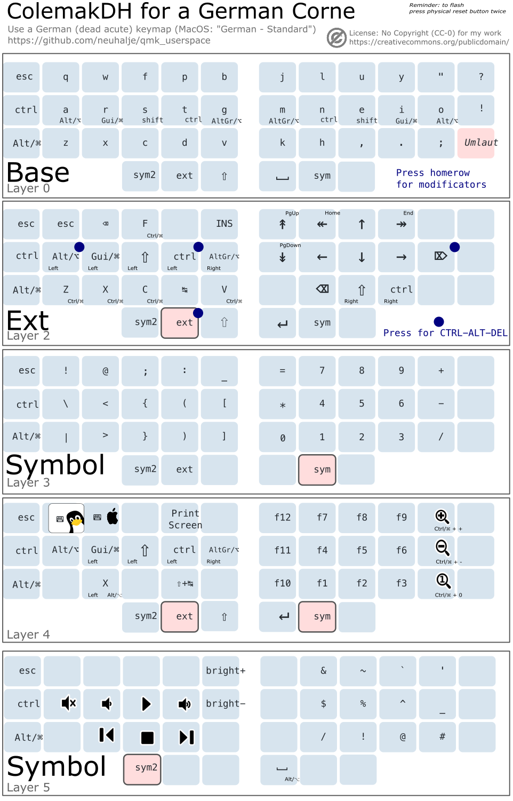

_I used [filterpaper/qmk_userspace](https://github.com/filterpaper/qmk_userspace) as a template and heavily stripped it down for my needs._

# Summary
This is my personal *userspace* for [QMK Firmware](https://github.com/qmk/qmk_firmware). It is setup as a self-contained folder that avoids placing `keymap.c` files inside keyboard sub-directories.

This keyboard layout supports a *German* *ColemakDH* layout with Linux (windows) & MacOS Support.



## Using on a Mac
Switch to the *Mac* base layout using the action in the *Function* layer.

# Building Userspace
This repository can be built as QMK's [userspace](https://docs.qmk.fm/#/feature_userspace) in a `users` folder by running `qmk compile` for the JSON files. [Actions](https://docs.github.com/en/actions) can also be leveraged to do likewise on a GitHub container with [build.yml](.github/workflows/build.yml) workflow.

```sh
git clone https://github.com/qmk/qmk_firmware.git ~/.qmk_firmware

git clone git@github.com:neuhalje/qmk_userspace.git ~/qmk_firmware/users/neuhalje
```

## Modular Corne (CRKBD) Build
You need to build for left and right separately. The command will automatically flash. Add the cable to the `left` halve and run with `SIDE=left`, then with `SIDE=right` on the right side.

```sh
SIDE=right  # or left

qmk flash \
    -kb crkbd  \
    -bl avrdude-split-${SIDE} \
    -e OLED=VERSION \
    ~/qmk_firmware/users/neuhalje/keymaps/corne_colemak.json

```

# Code Features
* [OLED](oled/) indicators and animation (courtesy of [filterpaper/qmk_userspace](https://github.com/filterpaper/qmk_userspace)) (but not used)


## Minimal build
Minimal firmware with no OLED and RGB support will be compiled with `-e TINY=yes`:
```
qmk compile -e TINY=yes corne.json
```

## Logo file
Images in `oledfont.c` can be viewed and edited with:
* [Helix Font Editor](https://helixfonteditor.netlify.app/)
* [QMK Logo Editor](https://joric.github.io/qle/)
* [image2cpp](https://javl.github.io/image2cpp/)


# Useful Links
* [Corne (CRKBD)](https://github.com/qmk/qmk_firmware/tree/master/keyboards/crkbd/rev1)
* [Seniply](https://stevep99.github.io/seniply/) 34 key layout
